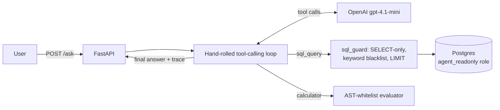
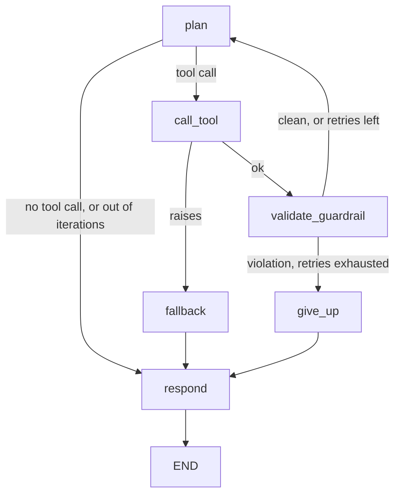

# EcommerceAnalystAgent

A tool-calling data analyst agent that answers natural-language questions over a real e-commerce dataset by planning and executing SQL step by step -- and, just as importantly, that admits when it can't, instead of guessing.

## Problem

Ad-hoc business questions ("what's our average order value?", "which category grew the most?") usually mean either a static dashboard that doesn't cover the question you actually have, or a single generated SQL query that either works or silently returns nonsense. This project is an agent that plans multi-step tool use (query, then another query to refine, then arithmetic) the way an analyst would, over the real [Olist Brazilian e-commerce dataset](https://www.kaggle.com/datasets/olistbr/brazilian-ecommerce), and is evaluated by **objective correctness** -- a number is right or it isn't -- rather than an LLM judging its own kind of answer. That's a deliberate contrast with [BusinessAssistant](https://github.com/sansaloniroge/BusinessAssistant)'s LLM-as-judge evaluation: two different evaluation methodologies, chosen because the two tasks actually call for different ones.

## Demo


Two real calls against the running API (no mocking): a question that needs two SQL queries and a calculator call comes back with the right number and its full tool trace; a question the dataset has no data for gets a plain refusal instead of a fabricated number. `docs/demo.tape` is the [VHS](https://github.com/charmbracelet/vhs) script that generated the GIF (`vhs docs/demo.tape`, API already running).

## Architecture



One service (FastAPI) and one database (Postgres) -- deliberately no queue, worker, or vector store. There's no retrieval or ingestion pipeline here; the "knowledge" is the schema itself, described once in `app/schema_doc.py` and embedded in the system prompt, so the model never needs a schema-discovery round trip.

## Stack

- **API**: FastAPI + uvicorn (`POST /ask`, `GET /health`)
- **Agent loop**: hand-rolled over OpenAI's tool-calling API (`app/agent.py`) -- no LangChain or agent framework, same "thin, explicit adapters" choice made in BusinessAssistant/PharmaAssistant. `temperature=0` for more reproducible tool calls; hard 6-iteration cap with an honest refusal fallback if it's exhausted. A second, equivalent implementation on LangGraph (`app/agent_langgraph.py`) lives alongside it -- see [Why two implementations](#why-two-implementations).
- **Tools**: `sql_query` (real SELECT-only SQL against Postgres, guarded -- see below) and `calculator` (arithmetic via an `ast`-whitelist evaluator, never `eval()` on model-supplied text)
- **Database**: Postgres, loaded once from the Olist CSVs (`poetry run load-dataset`); the agent connects as `agent_readonly`, a role with `SELECT`-only grants -- a real least-privilege boundary, not just an assumption
- **Model**: `gpt-4.1-mini`
- **Tests**: pytest -- unit tests for pure logic (guardrails, calculator, grading, agent control flow via a hand-written fake OpenAI client) run by default; `@pytest.mark.db` tests hit a real Postgres (`make test-db`)
- **CI**: GitHub Actions (lint + typecheck + the default `-m "not db"` test suite on every PR). The `@pytest.mark.db` tests are not run in CI -- they assert against the real loaded Olist dataset's exact row counts, and CI has no access to the Kaggle CSVs (deliberately not fetched via an API key or committed to the repo) -- so they're run locally only (`make test-db`), same as this README's own verification steps.

## How to run it

```bash
cp .env.example .env
# edit .env: set OPENAI_API_KEY

make up                       # docker compose up -d postgres, waits for healthy

# download the dataset manually from
# kaggle.com/datasets/olistbr/brazilian-ecommerce, unzip into data/raw/
set -a && source .env && set +a
poetry run load-dataset       # loads all 8 scoped tables + agent_readonly role

uvicorn app.main:app --app-dir src --reload
```

```bash
curl -X POST http://localhost:8000/ask \
  -H "Content-Type: application/json" \
  -d '{"question": "What percentage of all orders have status delivered?"}'
```

Run the eval suite: `poetry run run-eval` (see [Evaluation](#evaluation)). Run tests: `make test` (unit only) or `make test-db` (needs the real DB from the steps above).

Verified end-to-end from a completely clean `docker compose down -v` + fresh volume as of this README, including a full eval run.

## Key decisions

- **Objective-correctness eval, not LLM-as-judge.** Ground truth for each question was computed by hand via direct SQL against the real dataset, frozen once, then graded by rule-based checks (numeric tolerance, required substrings, refusal-phrase matching). See [Evaluation](#evaluation).
- **A regex/keyword blacklist for SQL guardrails, not a full parser.** `app/tools/sql_guard.py` rejects stacked statements, non-`SELECT`/`WITH` queries, and a blacklist of write/DDL keywords scanned across the *whole* query text -- which is what catches a data-modifying CTE hiding a write behind a `SELECT`-shaped outer query. This is defense in depth on top of the real primary control, `agent_readonly`'s DB-level privileges -- and it has a known gap (see [Known limitations](#known-limitations)).
- **`calculator` via an AST whitelist, never `eval()`.** The expression string comes from the model, so only numeric literals and arithmetic operators are ever evaluated; names, calls, and attribute access are structurally unreachable.
- **No queue, worker, or vector store.** There's no retrieval task here, so adding one would be scope creep for its own sake -- same discipline as not overbuilding BusinessAssistant's async ingestion pipeline before it was needed.

## A real gap found and fixed: correct answers, but the agent didn't know when to say no

Getting factual questions right turned out to be the easy part. The harder, more interesting failure showed up in the questions designed to have *no* answer.

**What was assumed:** the system prompt already said, since the very first version of the agent loop, "if the dataset genuinely cannot answer the question, say so plainly instead of fabricating an answer." That seemed like enough.

**What was found:** the first real eval run (`eval/dataset.json`, 3 deliberately unanswerable questions) showed the model correctly declining only 1 of 3. Asked for a profit margin on a product category, it used `freight_value` -- shipping cost -- as a stand-in for cost of goods and confidently reported an ~85% margin. Asked for a customer age distribution, it derived a fake "age" from order dates. Both answers were fluent, specific, and completely made up; neither could be produced by any correct SQL, because the underlying data simply isn't in the schema.

**Why it went unnoticed:** a generic "say so if you can't answer" instruction reads as sufficient until it's tested against a question where "almost answering" is possible by substituting a nearby column. Nothing before the eval set existed forced that test.

**The fix:** one explicit rule added to the system prompt (`app/schema_doc.py`), naming the two found anti-patterns directly -- "shipping cost is not a proxy for product cost, and an order date is not a proxy for a customer's age" -- and asking the model to check the schema actually contains what a question needs before answering.

**Proof, not a claim:** re-running the real eval against the live API, `correct_refusal_rate` went 33.3% → 100%, `success_rate` held at 100%, and `avg_tool_calls` dropped (the model now recognizes infeasibility from the schema doc alone instead of probing with SQL first). Two more real, smaller issues turned up *while re-verifying* and got fixed the same way -- one eval question had genuinely ambiguous wording (fixed by pinning down scope), and the refusal-phrase grading list was missing a common phrasing ("cannot calculate") that had marked one correct refusal as a failure (fixed by broadening the list, with a regression test using that exact real model output). Full detail in [PR #6](https://github.com/sansaloniroge/EcommerceAnalystAgent/pull/6).

## Evaluation

Objective-correctness evaluation (`eval/dataset.json` + `poetry run run-eval`) -- no LLM-as-judge. 15 questions: 12 factual (11 numeric, 1 requiring a specific category name), each with ground truth computed by hand via direct SQL against the real dataset, plus 3 deliberately unanswerable questions (no cost data, no purchase-channel data, no customer demographics anywhere in the schema).

**Latest run** (real OpenAI API + real dataset, n=15):

| Metric | Value |
|---|---|
| Success rate (12 factual questions) | 100% |
| Correct refusal rate (3 unanswerable questions) | 100% |
| Avg. tool calls per question | ~1.1-1.2 |

Grading is rule-based: numeric answers pass if any number extracted from the response text is within a fixed tolerance of the ground truth; the one text question requires specific substrings; refusals are graded by a hand-picked list of refusal phrases (or the agent's own hard-coded refusal message). This is intentionally simple, and imperfect on the margins -- see [Known limitations](#known-limitations).

### CI eval gate

Every PR into `dev` runs a real eval end-to-end (`.github/workflows/eval-gate.yml`): boots Postgres, loads the schema plus a small **synthetic CI fixture** (`db/ci_fixture.sql`, 5 questions in `eval/ci_dataset.json`, ground truth computed by hand from that fixture's own rows), runs the agent against real OpenAI, then scores it (`scripts/eval_gate_check.py` -- mean of success rate and correct-refusal rate as a percentage) against `eval_baseline.json`. It's a smoke gate, not the full 15-question benchmark above: CI has no access to the real Kaggle CSVs (see [Stack](#stack)), so the 15-question run against the real dataset stays a manual, local step. The PR fails and gets a comment with the score breakdown if the CI-fixture score drops more than 2 percentage points below baseline. Current baseline: 100% (5/5, `eval_baseline.json`).

**Updating the baseline on purpose**, when a change genuinely improves the system:

```bash
poetry run python -m scripts.update_eval_baseline eval_run_result.json
```

It prints the old vs. new score and asks for confirmation before overwriting `eval_baseline.json`. Commit the updated file as part of the same PR.

## Why two implementations

`app/agent.py` (the hand-rolled loop above) is a deliberate choice, not a gap -- but most teams hiring for this kind of role run their agents on a framework, so `app/agent_langgraph.py` is a second, equivalent implementation on [LangGraph](https://langchain-ai.github.io/langgraph/), sharing everything that isn't orchestration: same system prompt (`app/schema_doc.py`), same tools, same SQL guardrails (`app/tools/sql_guard.py`, imported directly -- not reimplemented), same `REFUSAL_MESSAGE`. Both are real, both are evaluated the same way (`poetry run run-eval --impl manual|langgraph`), and both live in the repo side by side rather than one replacing the other -- the point is being able to speak to both in an interview: why hand-roll one, and when the framework is the better call.



**State** (`AgentState`, a `TypedDict`): the LangChain message history (`Annotated[list[BaseMessage], add_messages]`, converted to/from OpenAI's wire format at the LLM call boundary via `langchain_core.messages.utils.convert_to_openai_messages` -- there's no `ChatOpenAI` wrapper here, same raw `openai` client as the manual loop, so the comparison below isolates orchestration as the actual variable), a `guardrail_violation` reason, a `retries` counter, `tool_exception`, and the running `trace`. **Checkpointing**: `MemorySaver`, keyed by `thread_id` -- real cross-turn memory, not just an in-request loop. Concretely:

> Turn 1 (fresh thread): *"How many total orders are in the dataset?"* → **"There are a total of 99,441 orders in the dataset."**
> Turn 2 (same `thread_id`, no restated context): *"And what percentage of those are delivered?"* → **"Approximately 97.02% of the total orders in the dataset are delivered."**

Turn 2 never re-sends turn 1's question or answer -- the 99,441 figure it reasons from comes entirely from checkpointed state. The eval runner still gives each of the 15 questions its own fresh thread (they're independent by design), so this multi-turn behavior doesn't show up in the eval numbers below -- it's a capability the manual loop doesn't have at all, demonstrated separately (`tests/test_agent_langgraph.py::test_checkpointing_carries_conversation_across_calls_with_same_thread_id`).

**Real run, both implementations, same 15 questions, same live OpenAI API + dataset:**

| Metric | Manual (`app/agent.py`) | LangGraph (`app/agent_langgraph.py`) |
|---|---|---|
| Success rate (12 factual) | 100% | 100% |
| Correct refusal rate (3 unanswerable) | 100% | 100% |
| Avg. tool calls / question | 1.07 | 1.07 |
| Avg. latency / question | 2.24s | 2.41s |

Identical correctness -- expected, since both call the same model with the same prompt and tools. The ~7.6% latency gap is the graph's own bookkeeping (state channel merges, checkpoint writes on every node transition) rather than anything answer-quality-related; not measured here: per-query cost, which would need usage tracking neither implementation currently has (see [Known limitations](#known-limitations)).

**The trade-off, honestly:** the manual loop is ~90 lines with the entire control flow visible in one `for` loop -- every retry, every edge case, is something I wrote and can explain line by line, and there's no framework version drift to track. LangGraph took more code (state schema, six node functions, three conditional-edge functions) to express the *same* behavior, but gets checkpointed multi-turn memory for free, makes the retry/fallback logic legible as an explicit graph rather than nested control flow, and is the shape most tooling (LangSmith tracing, LangGraph Studio, prebuilt nodes) expects. For a single-agent, single-provider tool like this one, the manual loop is the right call -- more moving parts here would earn nothing back. The trade-off flips once state gets genuinely complex (many nodes, human-in-the-loop interrupts, sub-agents) or the team already standardizes on LangGraph elsewhere -- know why you'd reach for the framework, not just how to.

**Deliberately not done:** `/ask` still runs the manual implementation only -- wiring in a `?impl=` query param would be easy but wasn't worth the API surface for a comparison that's already fully answered by the eval numbers above.

## Known limitations

- **The SQL guardrail is a keyword blacklist, not a real parser.** `ensure_row_limit` checks for the presence of a `LIMIT` keyword anywhere in the query text -- a `LIMIT` buried inside a subquery satisfies the check even though the outer query is technically still unbounded. Accepted as a known simplification (the design's deliberate scope was "blacklist + limit + timeout", not a SQL grammar library); the real backstop is still `agent_readonly`'s read-only DB privileges.
- **LLM sampling still has some run-to-run variance even at `temperature=0`.** One eval run before this pin surfaced a single-question miss (correct SQL and answer on a manual re-run of the exact same question moments later) -- real non-determinism, not a bug in the guardrails or grading. `temperature=0` reduces this but the API doesn't guarantee full determinism.
- **The refusal-phrase list is hand-picked, not exhaustive.** A genuinely correct refusal phrased differently than anything in `_REFUSAL_PHRASES` could still be marked as a grading failure rather than a model failure -- this already happened once and was fixed reactively (see the narrative above), which means it can happen again with a new phrasing.
- **n=15 is a smoke-test-sized eval set**, not a statistically significant benchmark -- useful for catching regressions, not for claiming a stable accuracy percentage.
- **No `chart` tool or detailed per-request trace beyond the tool-call list already in `/ask`'s response** -- both were explicitly optional ("Pro tier") in the original design and weren't built.
- **No per-query cost tracking in either agent implementation** -- the "Why two implementations" latency comparison has no cost column for the same reason: neither wraps the OpenAI client to capture token usage/pricing, so a real cost-per-query number isn't measured, not just omitted from the table.
- **No deployed demo.** A public endpoint backed by real OpenAI calls, running LLM-generated SQL, is a cost and abuse surface disproportionate to what a portfolio reviewer needs -- verified instead via a clean `docker compose up` + load + eval run (see [How to run it](#how-to-run-it)) and the GIF above, a real recorded run rather than a mockup.

## What's next

- Optional `chart` tool (matplotlib) for questions that ask for a visualization.
- Grow the eval set past 15 questions, and consider a second independent grader pass to catch the kind of refusal-phrase gap already found once.
- Revisit the SQL guardrail's `LIMIT`-in-subquery gap with a real SQL parser (e.g. `sqlglot`) if it ever turns out to matter in practice.

## License

[MIT](LICENSE)
